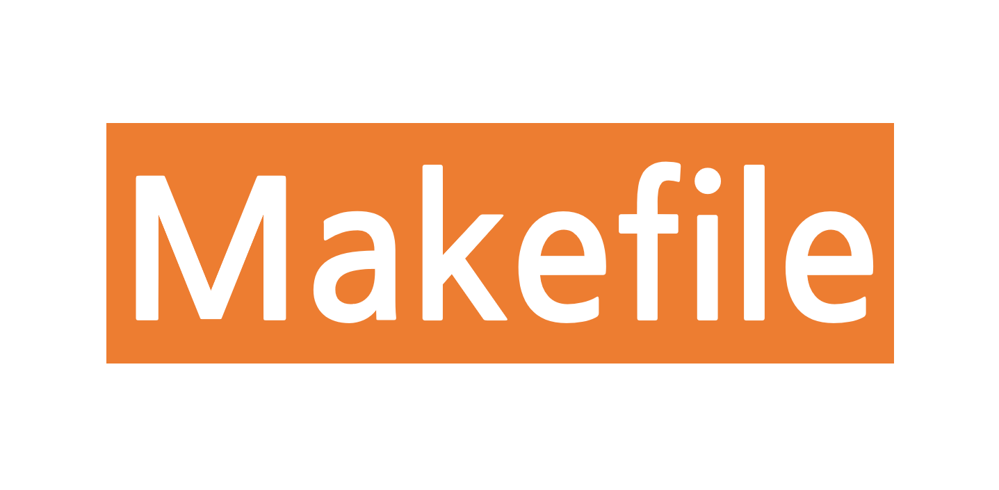

## 1. Configuración del Proyecto

Esta sección incluye la configuración inicial y los detalles de configuración necesarios para el proceso de construcción.

NAME = output_name: Especifica el nombre del archivo de salida (librería estática en este contexto).

CC = gcc: Define el compilador que se usará para el proyecto.

CFLAG = -Wall -Werror -Wextra: Establece las banderas del compilador para controlar el proceso de compilación.

## 2. Archivos Fuente y Objetos
Estas líneas tratan sobre especificar qué archivos fuente serán compilados y cómo se manejan los archivos objeto.

SRC_FILES = ft_printf_utils.c ft_printf.c: Lista los archivos fuente a ser compilados.

OBJS = $(SRC_FILES:.c=.o): Genera automáticamente una lista de archivos objeto a partir de los archivos fuente.

## 3. Reglas de Compilación
Esta categoría incluye las reglas sobre cómo compilar archivos fuente en archivos objeto y cómo enlazar los archivos objeto en el archivo de salida final.

%.o: %.c: Una regla de patrón para compilar archivos .c en archivos .o.

$(CC) -c $(CFLAG) $^: El comando usado para compilar los archivos fuente.

## 4. Objetivos de Construcción
Estos son los objetivos que puedes llamar explícitamente usando el comando make para construir el proyecto, limpiar archivos o reconstruir el proyecto.

all: $(NAME): El objetivo predeterminado, que construye el proyecto.

$(NAME): $(OBJS): Describe cómo construir el archivo de librería final a partir de archivos objeto.

clean:: Un objetivo para remover archivos objeto y limpiar el directorio del proyecto.

fclean: clean: Extiende el objetivo clean para también remover el archivo de salida final.

re: fclean all: Un objetivo para reconstruir el proyecto desde cero.

## 5. Objetivos Especiales

.PHONY: all clean fclean re: Indica que los objetivos listados no están asociados con archivos, sino que representan acciones.

RESUMEN

- Configuración y Configuración del Proyecto: Establece las configuraciones fundamentales como el compilador, nombre de salida y banderas de compilación.
- Manejo de Archivos Fuente y Objetos: Especifica qué archivos son parte del proyecto y cómo son transformados durante el proceso de construcción.
- Instrucciones de Compilación y Enlace: Proporciona instrucciones detalladas sobre cómo compilar y enlazar los archivos del proyecto.
- Gestión de la Construcción: Ofrece objetivos para construir, limpiar y reconstruir el proyecto, facilitando el mantenimiento fácil del proyecto.
- Directivas Especiales: Mejora la funcionalidad del Makefile con directivas como .PHONY para aclarar el propósito de ciertos objetivos.

## Ejemplo

NAME = OUTPUT_NAME

CC = gcc

CFLAG = -Wall -Werror -Wextra

SRC_FILES = ft_atoi.c \
           ft_toupper.c

HEADER = libft.h

LIBC = ar rcs

OBJS = $(SRC_FILES:.c=.o)

%.o: %.c
	$(CC) -c $(CFLAG) $^

all: $(NAME)

$(NAME): $(OBJS)
	$(LIBC) $(NAME) $(OBJS)

clean:
	rm -f $(OBJS)

fclean: clean
	rm -f $(NAME)

re: fclean all

.PHONY: all clean fclean re

